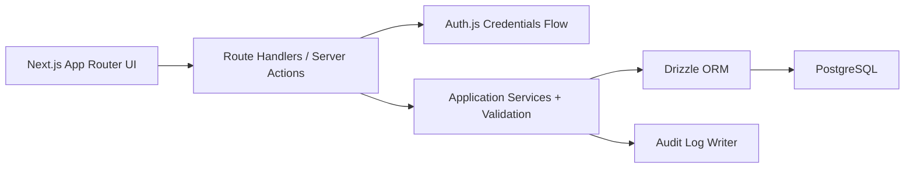

# CareerOS

CareerOS is a product-minded job application tracker built for students and junior developers who have outgrown spreadsheets, bookmarks, and fragmented notes.

The project combines product design, application workflow modeling, authentication, authorization, relational data design, and a dashboard that supports an actual recurring problem instead of just storing records.

## Why I Built This

Job searching becomes messy very quickly:

- companies live in one spreadsheet,
- application links live in another tool,
- notes live in random documents,
- interview schedules live on the calendar,
- follow-up reminders are easy to miss.

I built CareerOS to solve that fragmentation with a single workflow-oriented product.

The goal was not to make "another CRUD dashboard." The goal was to build a realistic product where data relationships, ownership rules, user flow, and product decisions all matter.

## Product Snapshot

- email and password authentication with Auth.js
- PostgreSQL plus Drizzle relational data layer
- application pipeline with status transitions
- company management and application linking
- interview tracking
- reminder tracking
- application notes
- list and kanban views for the same dataset
- basic audit logging and rate limiting foundations

## Demo

### Suggested Walkthrough

1. Sign in with the demo account.
2. Open the dashboard and show list view.
3. Switch to kanban view to explain the pipeline.
4. Create a company and a new application.
5. Change application status and show status history behavior.
6. Add a reminder, interview, and note to demonstrate workflow depth.

### Demo Assets

- Screenshot placeholders live in [`docs/screenshots`](./docs/screenshots/README.md)
- Video capture notes live in [`docs/videos`](./docs/videos/README.md)

## Architecture At A Glance



## What This Project Demonstrates

- product thinking beyond a basic dashboard
- modeling a multi-entity relational workflow
- user-scoped authorization in the service layer
- secure credential handling with password hashing
- application state transitions with auditability
- presenting the same underlying workflow in both list and kanban views

## Product Scope

This repository is intentionally closer to a real product than a generic starter app.

The focus is supporting an actual application workflow:

- track where each application came from
- monitor follow-up dates
- keep notes per application
- attach interview rounds
- organize work by status
- review the same pipeline in multiple views

## Core Domain Model

CareerOS centers on these entities:

- `users`
- `companies`
- `applications`
- `application_notes`
- `interviews`
- `reminders`
- `status_history`
- `audit_logs`

This matters because the project is not just a flat list of rows. It models a workflow with ownership, history, related entities, and user-specific access rules.

## Scaling Decisions

### 1. Next.js as the full-stack boundary

I chose a single Next.js App Router application for speed, cohesion, and simpler deployment.

Why:

- product iteration is faster,
- auth and UI live close to the application logic,
- the codebase stays easy to run locally,
- it is enough complexity for the current stage without splitting the system too early.

### 2. PostgreSQL plus Drizzle for relational consistency

The application revolves around strongly related entities: users, companies, applications, reminders, interviews, notes, and history records.

That makes a relational database the correct default. Drizzle keeps the schema explicit and type-safe without hiding the structure behind a heavy abstraction layer.

### 3. Service-layer ownership checks before database RLS

Ownership-aware queries and service-layer guards are already implemented so each user only works with their own records.

That is the right step for this stage because it keeps the system understandable. If the project needed stronger production hardening, database-level RLS would be a natural next step.

### 4. In-memory rate limiting first

Rate limiting is intentionally simple right now. It demonstrates the security concern without forcing distributed cache infrastructure into the project before it is needed.

The clear next move would be Redis or Upstash if the app moved toward multi-instance deployment.

## Tradeoffs

### Chosen now: one full-stack app, not separated frontend and backend services

This improves development speed and portfolio clarity, but it gives up independent scaling and deployment boundaries.

### Chosen now: credentials auth only

Email/password auth keeps the project easy to evaluate locally and avoids third-party provider setup. The tradeoff is that social login, password reset, and email verification are not yet part of the product.

### Chosen now: service-layer authorization

Authorization logic in the application layer is easy to read and discuss. The tradeoff is that it should eventually be reinforced with database-level policy enforcement in a harder production setting.

## Security Notes

- passwords are hashed with Argon2id
- auth is handled with Auth.js credentials flow
- access is scoped per user in the application layer
- SQL access stays parameterized through Drizzle
- security headers are set in Next.js config
- registration flow has basic rate limiting

## Tech Stack

- Next.js 16 App Router
- TypeScript
- PostgreSQL
- Drizzle ORM
- Auth.js
- Zod
- Tailwind CSS
- Vitest
- Playwright

## Local Setup

### 1. Install dependencies

```bash
npm install
```

### 2. Create your environment file

```powershell
Copy-Item .env.example .env
```

### 3. Start PostgreSQL

```bash
docker compose up -d db
```

### 4. Apply the schema and seed demo data

```bash
npx drizzle-kit push --force
npm run db:seed
```

### 5. Start the app

```bash
npm run dev
```

Open [http://localhost:3000](http://localhost:3000).

If port `5432` is already in use, change `POSTGRES_PORT` and `DATABASE_URL` together in `.env`.

## Demo Account

```text
Email: demo@careeros.local
Password: Password123!
```

## Scripts

```bash
npm run dev
npm run build
npm run start
npm run db:push
npm run db:seed
npm test -- --run
```

## Current Limitations

- rate limiting is in-memory
- credentials auth does not yet include password reset or email verification
- ownership checks live in the app layer rather than database-level RLS
- no background notifications or reminder delivery system yet

## Future Improvements

- Redis-backed distributed rate limiting
- email reminders and follow-up notifications
- calendar integration for interviews
- richer analytics for funnel conversion and response rates
- saved views and personalized dashboard summaries
- database-level RLS for stronger defense in depth

## Interview Narrative

Short version:

> I built CareerOS to solve a real workflow problem, not just to render records. The interesting part is how applications, companies, reminders, interviews, notes, and status history all fit together under user-scoped access control inside a product that still feels simple to use.
